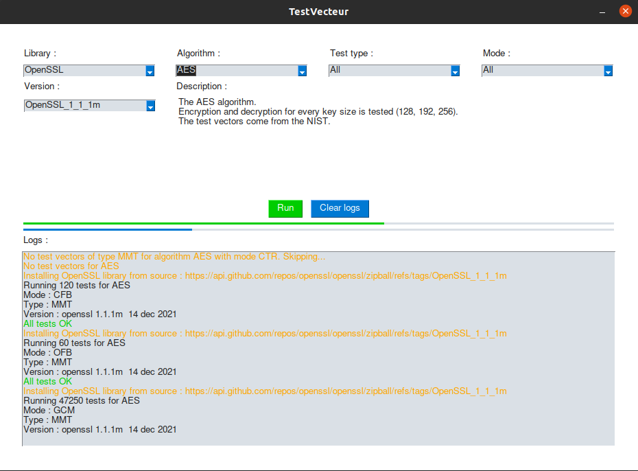

# TestVectors

Program to run various test vectors (in particular [those provided by the NIST](http://csrc.nist.gov/groups/STM/cavp/)) against cryptographic libraries.

Some of the key features of this tool are :
   - Install target library version from GitHub automatically.
   - GUI based on PySimpleGUI

## Dependencies

The following Ubuntu packages are needed.

```
sudo apt install build-essential default-jdk python3-tk
```

The following python modules are needed.

```
sudo python3 -m pip install pycryptodome cryptography beautifulsoup4 pysimplegui
```

## Usage

To start the GUI program, use the following command :
```
./gui.sh
```



## Currently supported

Here is a list of everything supported by the software at this point.

### Libraries
 - pycryptodome (just for tests)
    - Every Algorithm listed bellow
    
 - OpenSSL (All versions of branches 1.0.2, 1.1.0 and 1.1.1)
    - Every Algorithm listed bellow
    
 - BouncyCastle (JDK >= 15)
    - Every Algorithm listed bellow except ECDSA
    
 - mbedTLS (>= 2.15)
    - AES, SHA1/2, HMAC and RSA only

### Algorithms
 - AES
    - with modes : ECB, CBC, CTR, OFB, CFB, GCM
    - with vector types : KAT, MMT, MCT
 - SHA1, SHA2
    - with hash sizes : 224, 256, 384, 512
    - with vector types : KAT, MCT
 - HMAC
    - with above hashes
    - with vector type : MMT
 - ECDH
    - with curves : secp192r1, secp224r1, secp256r1, secp384r1, secp521r1, brainpoolP256r1, brainpoolP384r1, brainpoolP512r1
 - DH
    - with or without hashing the secret as a post-treatment
 - PBKDF2
    - with SHA1
 - ECDSA
    - with curves : secp192r1, secp224r1, secp256r1, secp384r1, secp521r1
 - RSASSA
    - PKCS1-v1.5 signature verification
        - Tests if the implementation is vulnerable to forging with small e


## TODO
 - Finish mbedTLS support
 - Add RSA PKCS1v1.5 support to all libs
 - better template documentation. Explain the parameters of functions.
 - Make it Windows compatible (so it can run tests against Windows-only libraries)
 - Support more algorithms :
    - RSA OAEP
    - RSA PSS
    - DRBG
 - Maybe, add a feature/vectors to POC easy known CVEs affecting all libs
    - like it was done for PKCS1-v1.5 signature forging

## FAQ

### A newer version of a supported library exists but does not appear in the selection list
Remove the `versions.pickle` file inside the `bin/<target_lib>` directory.
This will refresh the selection list by checking for all the available versions online.
Do not abuse this, as there is a rate limit on the GitHub API.

### I think I've found a bug or something isn't working properly
Open an issue describing your problem or contact Florian Picca (FPI) if it
needs to be fixed quickly. 

### I want to add a feature
Sure ! Checkout the [CONTRIBUTING](CONTRIBUTING.md) page.

## Contributors

- [Florian Picca](https://github.com/FlorianPicca)
- Mikael Benhaiem